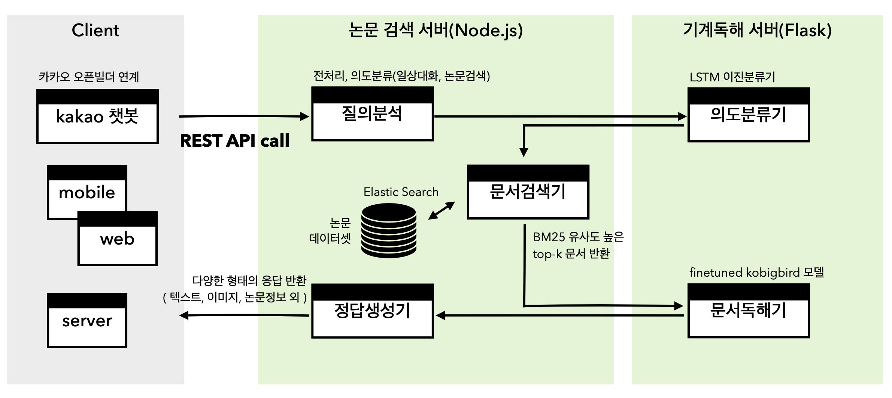
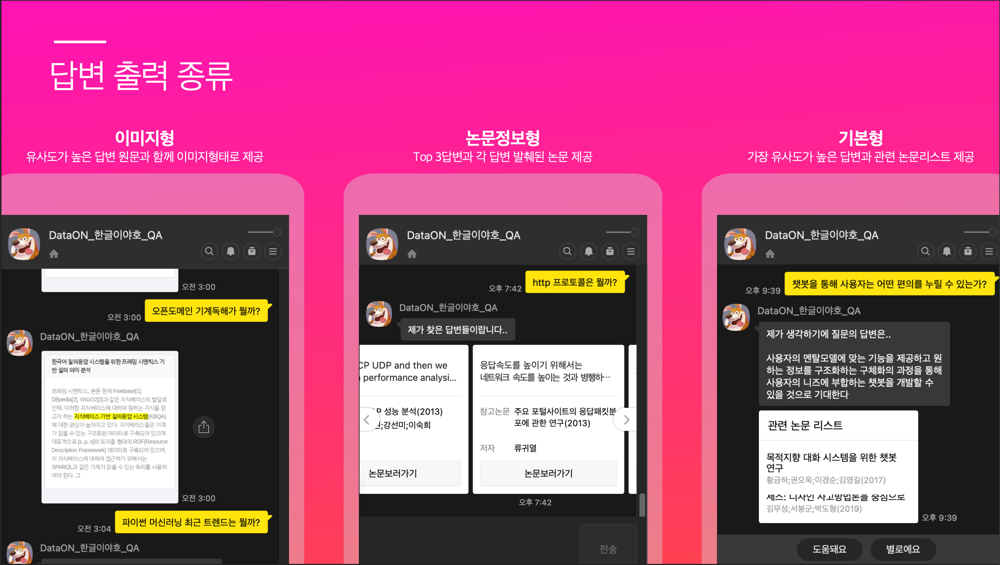

# 「2021 연구데이터·AI 분석활용 경진대회 - 한글이 야호」

# 1. Introduction - 프로젝트 설명
## 1-1. 참가정보
- 지원분야 : 인공지능
- 팀원구성 : 이경임(팀장), 이지훈, 유원준

## 1-2. 프로젝트 개요
> 한국어논문 오픈도메인 기계독해 수행을 위한 REST API기반 서버 구축
- 요약 
    : 국내 발행된 한국어 논문 정보를 효과적으로 검색, 분석하기 위한 시스템 구축을 목적으로 한다. 사용자의 자연어 질의에서 키워드를 추출해 연관성이 높은 논문을 찾아, 검색된 논문에서 질의에 대한 응답을 찾아낸다. 
    제안된 서비스는 REST API 기반의 서버로 구성하여 다양한 플랫폼에서 논문 데이터에 대한 오픈도메인 기계독해 결과를 자유롭게 사용할 수 있도록 한다.
- 제안배경 
    : 본 프로젝트는 국내 발행된 수많은 학위, 학술논문의 정보분석에 인공지능 기계독해 모델을 도입함으로서, 논문에 담긴 방대한 정보의 활용성을 높이고자 한다. 특히, 완성된 형태의 챗봇 인터페이스가 아닌 다양한 플랫폼에서 활용될 수 있는 REST API 기반의 서버 시스템을 구축함으로서 구축된 오픈도메인 기계독해 시스템을 다양한 서비스에서 유연하게 활용할 수 있도록 제공한다. 
    오픈도메인 기계독해는 근거문맥의 질문과 쌍이 사전에 주어지지 않는다. 예를들어, 사용자가 ‘KorQuAD 2.0에서 중복비율이 낮은 질문에 대한 기계독해 모델 F1점수는?’라고 질문했을때, 관련 논문 정보 ‘중복비율이 낮아질수록 F1 점수도 낮아지는 것을 확인할 수 있다. 기계독해의 경우는 63.7%에서 34.4%로 29.3%가 하락하였다.’를 찾은다음, 해당 논문에서 정답에 해당하는 ’34.4%’를 반환하는 시스템을 제안한다. 
    이때 사용자는 질의에 대한 답변 뿐만 아니라 해당 질의와 관련된 논문 목록 등 최종 답변을 생성하기까지 인공지능 모델 등을 통해 도출되는 다양한 정보를 REST API 형태로 호출해 받아옴으로서 고도화된 논문정보 분석에 활용할 수 있다.

## 1-3. 프로젝트 상세

- 시스템은 기본적으로 사용자의 질의에 대해 국내 발행된 논문에서 답변을 찾아 제공한다. 기본적으로 질의분석기, 문서검색기, 문서독해기, 답변생성기의 4개 모듈을 중심으로 구성된다.
- `질의분석기`는 사용자 질의에서 논문의 주제가 될 수 있는 핵심어를 도출한다. 또한 문서검색기의 성능을 높일 수 있도록 주어진 질의를 적절히 정재한다. 
- `문서검색기`는 정제된 질의를 이용해 질의에 대한 정답을 포함할 가능성이 높은 상위 K개의 후보군 논문을 걸러낸다. 이때 문서검색기는 Elastic Search를 이용해 BM25 유사도가 높은 문서를 선택한다. 
- `문서독해기`는 주어진 대회 데이터셋을 기반으로 학습된 인공지능 기계독해 모델로, 문서검색기를 통해 반환된 K개의 문서에서 정답의 근거가 될 수 있는 K개의 문맥을 찾아낸다. 
- `정답생성기`는 K개의 근거문맥에서 최종적으로 사용자에게 반환될 정답 문맥을 선택 후 사용자가 인식할 수 있는 다양한 형태로 정보를 반환한다.

# 2. How to use
## 2-1. 주요 소스 - REST API server(./2021AiHub-ODQA)    
- Plugin/
    - Chat.js : 채팅 request에 대한 실제 로직 처리
    - Elasticsearch.js : 구축된 논문 데이터베이스에서 Elastic search 수행 모듈
    - Pytensor.js : 요청종류에 따라 적절한 python 서버 호출
- server/app.js : node API서버 entry point
- services/chat.js : '/chat' url에 대한 요청/응답 처리

## 2-2. 주요 소스 - Python AI server(./2021AiHub-ODQA/python)
- app.py : flask AI서버 entry point
- casualtalker.py : 일상대화로 분류된 request에 대한 sentence transformers 기반 응답 생성
- predictor.py : 논문질의로 분류된 request에 대한 kobigbird모델 기반 예측 진행, 논문별 답변정보 반환

## 2-3. 주요 소스 - 기타
- models/ : 학습 진행한 모델 모음
    - intent_classifier : 의도분류모델
    - korquae_bert : 기계독해모델 v1. bert에 korquad데이터 학습
    - klue_mrc : 기계독해모델 v2. klue-roberta-base에 논문데이터 학습
    - kobigbird : 기계독해모델 최종. kobigbird에 논문데이터 학습
- train/ : 모델 학습에 사용한 코드
    - train_klue_mrc.ipynb : klue-roberta-base 모델 학습에 사용한 코드.
    - train_kobigbird.ipynb : kobigbird 모델 학습에 사용한 코드.
    - documents.csv : 기계독해 데이터의 논문 정보 전체
    - questions.csv : 기계독해 데이터의 질문 정보 전체
- python/
    - .venv_v3/ : python서버 실행 가상환경
    - requirements.txt : 서버 실행환경 의존 모듈
    - chatData.csv : 일상대화 응답 생성시 sentence transformers에서 참고하는 일상대화 질답데이터

## 2-4. 서버 실행스크립트
- ./run_all.sh : 현재 실행중인 노드 서버, 파이썬 서버 모두 종료 후 재실행하는 스크립트. 각각 8080, 5000 포트에서 실행
    - venv_v3 가상환경 폴더 있다는 가정하에 실행되는 스크립트로 가상환경 없는 경우 python/requirements.txt 모두 설치 후 run_all.sh 스크립트의 activate 라인만 주석처리후 실행
    - 로그는 서버 실행 스크립트 위치의 nohup.out 파일에서 확인하실 수 있습니다.
    - 스크립트 실행후 tail -f nohup.out 으로 서버실행 로그 확인
    - 실행 로그가 아래와 같이 끝나는 경우 정상실행된 것
    ```bash
        > 2021aihub-odqa@1.0.0 dev /home/ubuntu/2021AiHub-ODQA
        > cross-env NODE_ENV=development MODE=dev nodemon server/app.js

        [nodemon] 2.0.14
        [nodemon] to restart at any time, enter `rs`
        [nodemon] watching path(s): *.*
        [nodemon] watching extensions: js,mjs,json
        [nodemon] starting `node server/app.js`
        [57864] Express server has started at http://localhost on port 8080
        /home/ubuntu/2021AiHub-ODQA/python/.venv_v3/lib/python3.8/site-packages/pandas/compat/__init__.py:124: UserWarning: Could not import the lzma module. Your installed Python is incomplete. Attempting to use lzma compression will result in a RuntimeError.
        warnings.warn(msg)
        /home/ubuntu/2021AiHub-ODQA/python/app.py:17: FutureWarning: The error_bad_lines argument has been deprecated and will be removed in a future version.


        casualtalker = CasualTalker()
        * Running on http://127.0.0.1:5000/ (Press CTRL+C to quit)
    ```
- ./python/run_predictor.sh : Flask 인공지능 모델 서버 실행

# 3. Performence
- 자연어 질의 의도분류 : 감성대화 데이터셋 7만개와 논문 QA데이터셋의 질문 데이터 활용해 사용자 질의를 일상대화 or 논문검색으로 분류해낼 수 있는 classifier제작
- 질의 관련 논문 검색
    - 국내 논문 전문 데이터셋 적재. Elastic Search 이용해 관련 문서 검색
    - BM25유사도 높은 상위 3개 문서 검색하여 반환
    - Nori tokenizer 사용자 질의에 대한 한국어 형태소 분석 후 명사 추출해 인덱싱 사용
    - context, question, answer모두 포함한 multi match index사용해 성능 향상(top-3 기준 검색 정확도 55.5% -> 92.22%)
- 기계독해
    - 모델 학습시 논문 원문에서 답변구간 포함한 1500자 추출해 학습 진행
    - koBigbird 모델 적용
        - 논문 예측속도 향상 : 기존 BERT기반 모델에 비해 한번 예측시 최대 8배 긴 컨텍스트까지 다룰 수 있음
        - 논문 예측성능 향상 : 현 한국어 자연어처리 태스크에서 가장 좋은 성능 보이는 KLUE-RoBERTa 모델에 비해 1024자 이상의 long sequence 에서 더 우수한 예측성능 보임(Korquad2.1기준 EM, F1스코어 55.44, 73/02 -> 67.77, 82.03)

# 4. Prediction Example
## 4-1. 챗봇 확인하기
- 카카오톡 채널 "DataON_한글이야호_QA" 추가 후 질문시 동작 확인하실 수 있습니다.
- 안녕, 하이 등의 인삿말은 챗봇의 시작으로 판단, 사용자가 질의하도록 유도하는 기본설정 답변 반환합니다.
- 챗봇시작하기 > 답변 반환타입 선택시 챗봇이 시작됩니다.
    - 일상질의(예. 배고파)에 대해선 질문과 코사인 유사도 높은 감성대화 찾아 답변 반환합니다.
    - 논문검색(예. 기계독해란 뭘까?)에 대해선 기계독해 시스템을 통해 정답 가능성이 높은 답변구간을 추출해 반환합니다.
        - 기본형, 논문정보형, 이미지형 중 선택할 수 있습니다.

## 4-2. 챗봇 예시


# 5. References
- (사용모델1)KLUE-RoBERTa-base : 
- (사용모델2)KoBigbird : 
- 사용 주요 파이썬 라이브러리
    ```
    Flask==2.0.2
    pytorch-lightning==1.2.2
    sentence-transformers==2.1.0
    torch==1.10.0
    torchtext==0.8.0
    transformers==4.12.5
    ```

